# Architecture

## Overview

The project is a monorepo managed by [Turborepo](https://turbo.build/repo) with [Bun](https://bun.sh/) workspaces. It consists of three apps and one shared package.

## Tech Stack

### Backend (`apps/api`)

| Technology | Purpose |
|---|---|
| [Hono](https://hono.dev/) | Web framework |
| [Bun](https://bun.sh/) | Runtime, package manager, test runner |
| [Prisma](https://www.prisma.io/) | ORM for PostgreSQL |
| [Playwright](https://playwright.dev/) | Browser automation for checking plates |
| [Trigger.dev](https://trigger.dev/) | Background job scheduling and execution |
| [Sentry](https://sentry.io/) | Error monitoring (production only) |
| [Scalar](https://scalar.com/) | Interactive API reference at `/docs` |

### Frontend (`apps/web`)

| Technology | Purpose |
|---|---|
| [Next.js](https://nextjs.org/) | React framework (App Router) |
| [shadcn/ui](https://ui.shadcn.com/) | Component library (Radix primitives) |
| [Tailwind CSS](https://tailwindcss.com/) | Utility-first styling |
| [ReactFlow](https://reactflow.dev/) | Workflow builder canvas |
| [Zustand](https://zustand-demo.pmnd.rs/) | State management (builder store) |
| [React Hook Form](https://react-hook-form.com/) | Form handling with Zod integration |
| [Axios](https://axios-http.com/) | HTTP client with retry logic |

### Shared (`packages/shared`)

The shared package is the single source of truth for types and validation used by both apps:

| Export | Description |
|---|---|
| `validators` | Zod schemas for license plates, users, workflows |
| `workflow-dsl` | Graph schema, node config schemas, type definitions |
| `builder-ir` | Intermediate representation schema for compiled workflows |
| `template-variables` | Variable definitions, parser, and resolver |
| `node-registry` | Node type registry with specs, ports, and config schemas |
| `types` | Shared TypeScript types (User, Check, Workflow, Execution) |
| `constants` | Limits and scheme constants |

## Data Flow

### License Plate Check Flow
This diagram shows the network communication flow triggered by a user creating a check request with a workflow attached. Attaching a workflow to an existing check will trigger the same flow.

```mermaid
sequenceDiagram
    participant U as User
    participant FE as Frontend<br/>Vercel
    participant BE as Backend<br/>Fly.io
    participant DB as PostgreSQL<br/>Supabase
    participant TD as Trigger.dev
    participant PW as Playwright<br/>Worker
    participant CW as City Website

    rect rgb(240, 245, 255)
    note right of U: User creates a check
    U ->> FE: Submit check form
    FE ->> BE: POST /request/new (JWT)
    BE ->> DB: Insert LicenseplateCheck
    BE ->> TD: schedules.create() cron schedule
    BE -->> FE: 201 Created
    end

    rect rgb(240, 255, 240)
    note right of TD: Daily scheduled execution
    TD ->> BE: POST /internal/execute-check/:id<br/>X-Internal-Secret
    BE ->> DB: Load check + workflow
    BE ->> BE: Compile graph → IR
    BE ->> TD: tasks.trigger(executeWorkflow, { ir, callbackUrl })
    TD ->> PW: Run task
    PW ->> CW: Playwright automates browser
    CW -->> PW: Page responses
    PW ->> BE: POST /webhooks/trigger <br/>X-Webhook-Secret
    BE ->> DB: Update check status + execution logs
    end
```

## Database

PostgreSQL hosted on [Supabase](https://supabase.com/) (Frankfurt region). Uses pgBouncer for connection pooling at runtime and a direct connection for migrations.

### Key Models

| Model | Description |
|---|---|
| `User` | User accounts with profile information (name, address, etc.) |
| `CityAbbreviation` | Available German cities with reservation website URLs and allowed domains |
| `LicenseplateCheck` | Individual check requests with status, scheduling info, and workflow reference |
| `Workflow` | Automation definitions with name, city, graph definition (JSON), and publish state |
| `WorkflowExecution` | Execution history with status, logs, outcome, duration, and error details |

