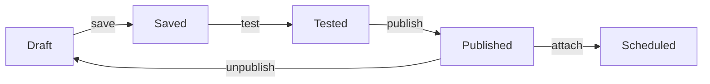

# Workflow Builder

The workflow builder is a visual node-based editor for creating automation workflows that check license plate availability on city reservation websites. It uses [ReactFlow](https://reactflow.dev/) for the canvas and [Zustand](https://zustand-demo.pmnd.rs/) for state management.

<!-- TODO: Add a screenshot of the builder canvas with a sample workflow -->

## Components

### Canvas

The main ReactFlow canvas where nodes are placed and connected. Supports panning, zooming, and node selection. Nodes are connected by dragging from output handles to input handles.

### Bottom Palette

<!-- TODO: Add a screenshot of the bottom palette -->

A floating toolbar at the bottom of the canvas containing draggable node buttons for all available node types. Includes a **Test** button that opens the test execution dialog.

### Toolbar

The top toolbar provides:
- **Undo/Redo** — History navigation (`Cmd+Z` / `Cmd+Shift+Z`)
- **Save** — Saves the current graph to the backend
- **Publish/Unpublish** — Toggles workflow availability, validation required

### Test Dialog

A modal for entering test variables (letters and numbers) before executing a test run. Shows the remaining daily test quota.

### Outcome Toast

After a test execution completes, a toast notification will show the result (`available` or `unavailable`). The user is asked whether the reached outcome was expected, with options to **confirm** (enables publishing) or **reject** (keeps workflow in draft).

### Execution Error Banner

Displays validation or execution errors directly on the canvas when a test run fails. Additionaly, the node where the error occured will be highlighted in red.

## State Management

The builder uses a Zustand store (`app/builder/store/builder-store.ts`) that manages:

| State | Description |
|---|---|
| Nodes and edges | ReactFlow graph state |
| Workflow metadata | ID, name, city, website URL |
| Publish state | Published flag, canPublish flag |
| Execution state | Running status, execution ID, test quota, node statuses |
| Undo/redo | History stack |
| Dirty tracking | Compares current graph against saved snapshot (ignoring node positions) |

## Workflow Lifecycle

- **Draft** — New workflows start as drafts. Editable at any time.
- **Saved** — Persisted to the backend. Still requires testing before publishing.
- **Published** — Validated, compiled, and available for use with checks. Cannot be edited until unpublished.
- **Scheduled** — Attached to a check with a daily Trigger.dev cron schedule.

::: warning
Publishing requires a successful test execution first. Any structural change (adding/removing nodes, changing config) resets the `canPublish` flag, requiring another test. Keep in mind the daily amount of test executions is limited.
:::

## Template Variables

Nodes that accept text input (Type Text, Select Option, Open Page, Conditional) support template variables resolved at execution time.

**License Plate:**

| Variable | Description |
|---|---|
| `{{plate.cityId}}` | City code (e.g. `B`, `HH`) |
| `{{plate.letters}}` | Letters from the check |
| `{{plate.numbers}}` | Numbers from the check |
| `{{plate.fullPlate}}` | Full plate string |

**User Profile:**

| Variable | Description |
|---|---|
| `{{user.firstname}}` | User's first name |
| `{{user.lastname}}` | User's last name |
| `{{user.salutation}}` | Salutation (Herr, Frau, etc.) |
| `{{user.birthdate}}` | Date of birth |
| `{{user.street}}` | Street name |
| `{{user.streetNumber}}` | Street number |
| `{{user.zipcode}}` | ZIP code |
| `{{user.city}}` | City name |

Maximum 2 variables per field. Each variable can only be used once across the entire workflow. A visual picker in each input shows available variables and disables already-used ones.

## Test Execution

Users can test workflows before publishing with a limited daily quota. Test runs:

1. Save the current workflow automatically
2. Accept variable overrides (letters, numbers) via the test dialog
3. Compile the graph and execute through the Trigger.dev pipeline
4. Poll for progress every 1.5 seconds, showing live node status on the canvas
5. Return execution logs and the final outcome
6. Do not affect any check status

<!-- TODO: Add a screenshot showing a workflow mid-execution with node status indicators -->
