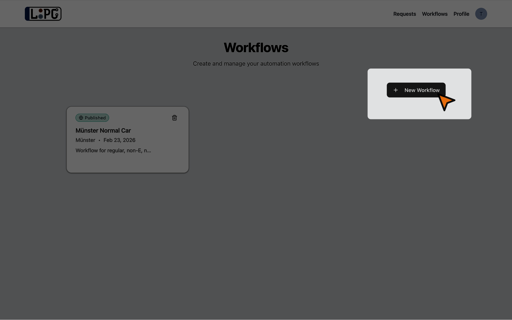
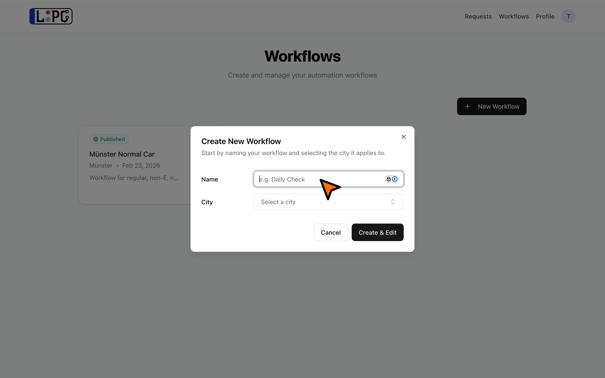
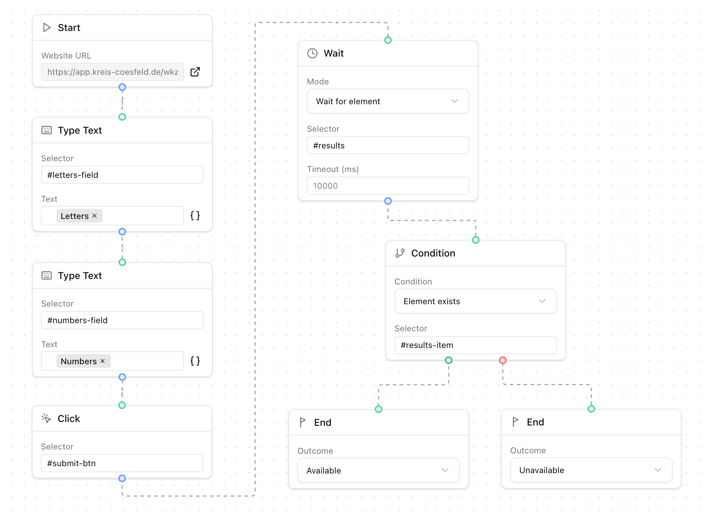

# Creating a Workflow

This guide walks through building a workflow that checks license plate availability on a city's reservation website.

## Prerequisites

- A registered account
- Familiarity with CSS selectors (browser DevTools → right-click → "Copy selector")
- A city with an online reservation website, see currently [Supported Cities](/appendix/supported-cities) for a list of confirmed working cities

## Step 1: Create a New Workflow

1. Navigate to **Workflows** from the navigation bar


2. Click **New Workflow**


3. Enter a name and select the target city


4. Click **Create & Edit** — the builder canvas opens


The canvas starts with a **Start** node (showing the city's website URL) and two **End** nodes, one for each possible outcome.

## Step 2: Plan Your Flow

Before adding nodes, open the target city's reservation website in another tab. Identify the steps needed:

1. Which fields need to be filled in? (letters, numbers, city, personal details)
2. Are there dropdowns to select from?
3. Which buttons need to be clicked?
4. Are there any pages that load or redirects that happen?
5. How do you know the plate is available vs. unavailable?

## Step 3: Add Nodes

You can add nodes either by clicking or dragging them from the **bottom palette** onto the canvas.


The most commonly used nodes are:

- **Type Text** — fill in form fields using CSS selectors and template variables like <code v-pre>{{plate.letters}}</code>
- **Click** — click buttons and links
- **Select Option** — pick an option from a `<select>` dropdown (by text, value, or index)
- **Wait** — pause for a duration, wait for an element to appear, or wait for a new tab
- **Conditional** — branch the flow based on whether an element exists or contains specific text

For a full reference of all node types and their configuration options, see [Node Types](/frontend/node-types).

## Step 4: Connect Nodes

Drag from an output handle (bottom of a node) to an input handle (top of another node). Each output can only connect to one input.


## Step 5: Test the Workflow

1. Click the **Test** button in the bottom palette
2. Enter test values for letters and numbers
3. Click **Run Test**
4. Watch the nodes light up as they execute
5. Review the outcome toast — **Confirm** if correct, **Reject** if not

::: tip
You have a limited number of test executions per day. Use the city's website manually first to understand the flow before testing.
:::

## Step 6: Publish

After a successful test, click **Publish** in the toolbar. The workflow is now available for use with license plate checks.

## Example: Simple Form Fill

A typical workflow for a city that has a simple form:



```
Start
  → Type Text (selector: "#letters", text: "{{plate.letters}}")
  → Type Text (selector: "#numbers", text: "{{plate.numbers}}")
  → Click (selector: "#submit-btn")
  → Wait (mode: For element, selector: "#results")
  → Conditional (operator: exists, selector: "#results-item")
    → true: End (outcome: available)
    → false: End (outcome: unavailable)
```

## Tips

- **Use `Wait for element`** instead of fixed duration waits — it's more reliable and faster
- **Test with real plate numbers** to see both the available and unavailable paths
- **Check both branches** of a Conditional node to make sure both outcomes are handled
- **Use browser DevTools** to find the right CSS selectors — right-click an element → Inspect → right-click the HTML → Copy → Copy selector. You can also use a browser extensions to help with this.
